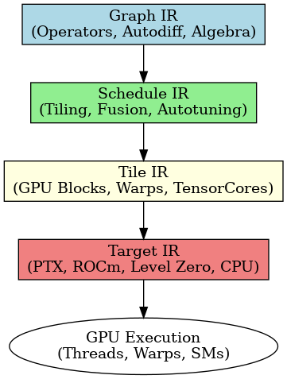
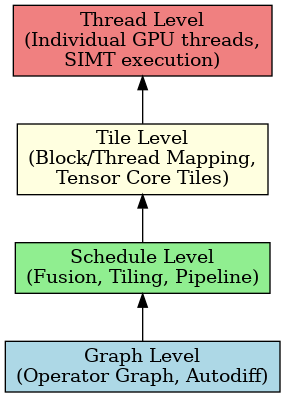

# Tessera

Tessera is a next-generation programming model and compiler stack for deep learning, HPC, and scientific workloads.  
It introduces a multi-level IR (Graph → Schedule → Tile → Target) and a DSL for operator-based modeling, enabling deterministic, scalable, and portable execution across NVIDIA, AMD, Intel, and CPU backends.

---

## 🔎 Overview Diagrams

### 1. Tessera Execution Flow



- **Graph IR**: Operator algebra, autodiff, symbolic transformations  
- **Schedule IR**: Fusion, tiling, autotuning, pipeline scheduling  
- **Tile IR**: Explicit GPU mapping (blocks, warps, Tensor Cores)  
- **Target IR**: Lowered to PTX, ROCm LLVM, Intel Level Zero, CPU LLVM  

---

### 2. Tessera Execution Hierarchy (like CUDA’s Grid/Block/Thread Pyramid)



- **Graph Level** → Operator graph, autodiff  
- **Schedule Level** → Fusion, tiling, pipeline  
- **Tile Level** → Block/thread mapping, Tensor Core tiles  
- **Thread Level** → Individual GPU threads, SIMT execution  

---

## 📚 Documentation

The full documentation set is organized by topic:

- **[Programming Guide](docs/Programming_Guide/)** – Core language features and usage  
- **[Performance Best Practices](docs/Performance/)** – Occupancy, memory tuning, autotuning  
- **[Numerical Behavior Guide](docs/Numerical_Behavior/)** – Determinism, stability, mixed precision  
- **[Interop & Tooling Guide](docs/Tools_Interop/)** – Python, C++, MLIR, debuggers, profilers  
- **[Hardware Mapping Guide](docs/Hardware_Mapping_Guide/)** – Mapping Tessera onto GPUs  
- **[Tutorials Volume](docs/Tutorials/)** – Hands-on walkthroughs  
- **[Operator Reference](docs/Reference/Tessera_Operator_Reference.md)** – Operator catalog  
- **[Runtime & ABI Spec](docs/Runtime_ABI/)** – Normative runtime and ABI specification  
- **[IR Specifications](docs/IR_Documentation/)** – Graph IR, Schedule IR, Tile IR, Target IR 
- **[Uncertenty & Robustness Guide](docs/Tessera_Uncertainty_Robustness/docs/)** - Predictive uncertainty capabilites
- **[Lifelong Learning](docs/Tessera_Lifelong_Learning_Package/docs/)** - Lifelong Learning Solutions 
- **[Interpretability Artifacts](docs/Tessera_Interpretability_Package/docs/)** - prediction can return feature attributions, concept relevance, counterfactuals, and causal structure
- **[Differentiable Architecture Search](docs/Tessera_DNAS_Package/docs/)** - Differentiable Neural Architecture Search (DNAS)
- **[Quality Assurance & Testing](docs/Quality_Assurance_Testing/)** - Q&A Testing Guide
- **[PyTorch Bridge](docs/Tessera_PyTorch_Bridge/docs/)** - Tessera Pytorch Language Bridge
- **[Learning Specification Language (LSL)](docs/Tessera_LSL_Package/docs/)** - Declaritive Language which allows you describe Higher 
level Learning Abstractions 
- **[Probabilistic Programming](docs/Tessera_ProbProg_Package/docs/)** - Uncertainty and probabilistic reasoning support 
- **[Shape Debugging System](docs/Tessera_Shape_System_Package/)** -  Shape System with Compile-Time Verification 

# Tessera Model Examples

This section provides **end-to-end examples** of mapping real-world models and reasoning frameworks onto the Tessera programming model.  
Each example illustrates how Tessera’s multi-level IR (Graph IR → Schedule IR → Tile IR → Target IR) and runtime abstractions support scalable, efficient, and interpretable model design.  

---

## Available Examples

- **[Hierarchical Reasoning Model (HRM)](HRM/Tessera_HRM_Mapping.md)**  
  Mapping HRM’s Planner–Decomposer–Executor architecture into Tessera’s Graph IR and Schedule IR layers. Includes diagram of HRM ↔ Tessera IR mapping.

- **[GPT-OSS-120B](GPT-OSS-120B/Tessera_GPTOSS_Example.md)**  
  Illustrates how Tessera handles large-scale transformer models with distributed tensors, checkpointing, and efficient sharding strategies.

- **[Physics-Informed Neural Networks (PINN)](PINN/Tessera_PINN_NavierStokes.md)**  
  A 2D Navier–Stokes example with incompressibility constraints. Demonstrates Tessera’s operator adjoints for coupled PDE systems.

- **[Spectral Mixture-of-Experts (Spectral-MoE)](MoE/Tessera_Spectral_MoE.md)**  
  Combines FFT-based spectral decomposition, recursive operators, and MoE routing. Highlights Tessera’s strength in operator factorization and distributed expert parallelism.


---

## 🚀 Quick Example

```python
from tessera import op, dist

# Create a distributed mesh across 8 GPUs
mesh = dist.Mesh(axes=["dp"], devices=range(8))

# Define a sharded tensor
X = dist.tensor((1024, 1024), layout=dist.ShardSpec(("row",), ("dp",)), mesh=mesh)

# Apply a fused operator pipeline
Y = op.pipeline([
    op.matmul(X, X.T),
    op.relu,
    op.layernorm
])
```

---

## 📌 Repository Structure

```
tessera/
├── docs/
│   ├── overview/                 # High-level diagrams
│   ├── programming_guide/        # Main programming guide
│   ├── performance/              # Performance best practices
│   ├── numerical/                # Numerical behavior guide
│   ├── runtime_abi/              # Runtime & ABI spec
│   ├── hardware_mapping/         # GPU mapping guide
│   ├── tutorials/                # Hands-on tutorials
│   ├── interop/                  # Interop & tooling guide
│   └── reference/                # Operator reference
└── README.md                     # This file
```

```
docs/models_examples/
 ├── HRM/  
 │    ├── Tessera_HRM_Mapping.md  
 │    └── Tessera_HRM_Mapping_Diagram.png  
 ├── GPT-OSS-120B/  
 │    └── Tessera_GPTOSS_Example.md  
 ├── PINN/  
 │    └── Tessera_PINN_NavierStokes.md  
 ├── MoE/  
 │    └── Tessera_Spectral_MoE.md  
 └── README.md   ← index listing all example models
 ```

Tessera Standard Operator Library (TSOL)
```
docs/TSOL/
├── TSOL_Guide.md
├── tessera/
│   └── ops.pyi
├── include/
│   └── tessera/
│       └── ops.hpp
├── tests/
│   └── test_stubs.py
└── mypy.ini
```
Tessera Collectives & Distributed Systems Guide
```
docs/Tessera_Collectives_Distributed/
├── Tessera_Collectives_Distributed.md
├── README.md
└── images/
    ├── mesh_collectives.png
    └── zero_flow.png
```
---

## 🔮 Roadmap

- Expand operator libraries (cuBLAS, cuDNN, cuFFT equivalents in Tessera).  
- Add integration with Hugging Face models for inference.  
- Optimize distributed training at 128+ node scale.  
- Extend tooling (profiler, debugger, autotuner caches).  
