# NVL72_Mapping.md
Tessera → NVIDIA GB200 NVL72: Topology‑Aware Mapping, Optimizations, and Recipes  
*(August 2025, draft — informative)*

---

## 0) Scope & Assumptions
This document refines the Tessera↔NVL72 mapping, identifying **additional optimizations** and **mapping details** beyond the initial plan. It is **system‑aware** but vendor‑neutral in API terms. Numbers are indicative; tune with your hardware telemetry.

**Abbreviations**
- **tp**: tensor parallel, **ep**: expert parallel (MoE), **pp**: pipeline parallel, **dp**: data parallel  
- **DTensor**: distributed tensor (Tessera) with a layout over a device mesh  
- **RS→MM→AG**: Reduce‑Scatter → MatMul → All‑Gather (tensor‑parallel matmul pattern)  
- **A2A**: all‑to‑all collective (for MoE token routing)  

---

## 1) Hardware Snapshot (for mental model)
- Single **NVLink domain** with 72 GPUs (GB200) + associated Grace CPUs.  
- **NVLink‑Switch** fabric provides very high intra‑rack bandwidth/low latency for collectives and A2A.  
- Per‑GPU **HBM3e** is the hot tier; Grace **LPDDR** is a coherent capacity tier (use for cold params/datasets).  
- Blackwell **Transformer Engine** supports FP8 training, FP4 inference; keep **f32** masters for stability.

> Treat the rack like a “fat node” with a topology that strongly rewards **in‑rack** collectives and carefully planned **sub‑meshes**.

---

## 2) Tessera Mesh & Layouts — Deep Dive
Define a **4‑axis mesh** to match compute and comms patterns:
- `tp`: shard weight matrices and heads (heavy GEMMs).  
- `ep`: shard experts (MoE).  
- `pp`: assign layer blocks to pipeline stages.  
- `dp`: replicate for global batch or draft/verify concurrency.

### 2.1 Recommended axis factorizations (72 GPUs)
- **Recipe A (attention‑heavy)**: `tp=12, ep=6, pp=1, dp=1`  
- **Recipe B (expert‑heavy)**: `tp=8, ep=9, pp=1, dp=1`  
- **Recipe C (pipeline‑friendly)**: `tp=8, ep=6, pp=3, dp=1`

All keep collectives **within the NVLink domain**. If you add dp>1, keep each replica fully in‑rack.

### 2.2 DTensor layouts
- **Attention**: `K,V` **column‑sharded** over `tp` (enables **RS→MM→AG**); keep `Q` replicated or lightly sharded.  
- **FFN**: shard expansion dimension over `tp`; fuse bias+activation in tile kernels.  
- **MoE**: expert weight banks **sharded over `ep`**; router outputs token→expert buckets (A2A within rack).  
- **KV cache**: sharded across `tp` and chunked by time; keep *recent* chunks GPU‑resident, spill old chunks to neighbor GPUs or Grace via NVLink.

---

## 3) Optimizations Beyond the Baseline

### 3.1 MoE routing optimizations
1. **Length/type bucketing** before A2A to avoid head‑of‑line blocking.  
2. **Locality‑aware routing**: penalize experts outside the local NVSwitch sub‑group; add a regularizer in the gating loss.  
3. **A2A fusion**: fuse `pack → A2A → unpack` into a single Tessera operator so planner schedules the packing on the A2A stream, not the compute stream.  
4. **Capacity factor tuning**: choose CF≈1.1–1.3 and dynamic overflow to balance token drops vs. network spikes.  
5. **On‑wire quantization** (policy‑gated): send A2A payloads in **FP8** with f32 stats sideband; dequantize on receipt.

### 3.2 Attention optimizations
1. Prefer **causal FlashAttention** with row‑wise max‑subtracted softmax; accumulate in f32.  
2. **Sequence/context parallelism**: split long contexts across `tp` sub‑groups (ring/striped attention), reducing per‑GPU KV pressure.  
3. **KV locality**: co‑locate K/V shards with subsequent PV matmuls to avoid gathers; use **reduce‑scatter** for attention logits when possible.  
4. **Prefetch KV** from Grace tier in background streams for long sequences.

### 3.3 Pipeline & overlap
1. Use **pp=2–3** to ease thermal/memory peaks; micro‑batch to fill bubbles.  
2. Assign **dedicated streams**: `S_compute`, `S_a2a`, `S_tp_collective`, `S_io`.  
3. Enforce an **event DAG** so A2A overlaps with next layer’s compute; avoid global barriers.  
4. Stage‑wise **weight prefetch** when experts swap in from Grace.

### 3.4 Numerics + determinism
1. FP8/FP4 with **per‑channel scaling**; clamp+rescale at layer granularity.  
2. Deterministic reductions: fixed NCCL order; Kahan/Neumaier summation when f32 variance is high.  
3. Seed gating RNG both globally and per‑axis (`tp`, `ep`) for reproducible MoE dispatch.

### 3.5 Memory strategy
1. **Activation remat** on every other block; checkpoint attention pre‑softmax.  
2. **KV windowing**: chunk KV by segments; drop stale segments for limited look‑back tasks.  
3. **Expert bank tiers**: hot experts pinned in HBM; cold experts in Grace; proactive prefetch by router’s “look‑ahead” scores.

### 3.6 NCCL & topology hints (informative)
- Use **hierarchical** algorithms (intra‑submesh reduce, inter‑submesh gather) where applicable.  
- Prefer **Tree** for small payloads, **Ring** for large sustained bandwidth; Tessera can tag collectives accordingly.  
- Pin process ranks to a **consistent physical order** (via `dist.Mesh` → runtime rank map) to stabilize routing paths.

---

## 4) Detailed Mapping Recipes (with code)

### 4.1 Mesh & layouts (Tessera pseudocode)
```python
from tessera import dist, op, graph, runtime as rt

# Recipe A: tp=12, ep=6, pp=1, dp=1 over 72 GPUs
mesh = dist.Mesh(
    axes=["tp","ep","pp","dp"],
    shape={"tp":12, "ep":6, "pp":1, "dp":1},
    devices=[f"GPU{i}" for i in range(72)]
)

# Layouts
Rep     = dist.ReplicateSpec(mesh_axes=("tp","ep","pp","dp"))
ColTP   = dist.ShardSpec(partition=("col",),   mesh_axes=("tp",))
RowTP   = dist.ShardSpec(partition=("row",),   mesh_axes=("tp",))
ExpertE = dist.ShardSpec(partition=("experts",), mesh_axes=("ep",))

# Numerics
POLICY_TRAIN = op.numeric(dtype="fp8_e4m3", accum="f32", deterministic=True)

# Attention w/ KV sharded over tp
Attn = op.flash_attention(
    num_heads=128, head_dim=128, causal=True, policy=POLICY_TRAIN,
    q_layout=Rep, k_layout=ColTP, v_layout=ColTP
)

# MoE (A2A inside ep)
MoE = op.moe(
    num_experts=4096, top_k=2, capacity_factor=1.25,
    gate="topk_softmax_locality_penalized", experts_layout=ExpertE,
    policy=POLICY_TRAIN
)

# Router cost regularizer (discourage far experts)
op.set_router_regularizer(MoE, kind="topology_distance", weight=0.05)
```

### 4.2 RS→MM→AG attention path (sketch IR)
```mlir
%S_rs  = ttile.collective.reduce_scatter %S_partial {axis="tp"}  // logits shards
%P     = ttile.softmax %S_rs                                    // local softmax
%O_loc = ttile.dot %P, %V_shard                                 // local PV
%O     = ttile.collective.all_gather %O_loc {axis="tp"}          // assemble
```

### 4.3 Fused MoE routing (pack→A2A→unpack in one op)
```mlir
%Y = toperator.moe_route %X, %G, @Experts
     { a2a_axis="ep", quantize_fp8=true, capacity_factor=1.25, pack_fused=true }
```

### 4.4 Streams & events
```python
rt.set_stream_map({
  "compute": 0, "tp_collective": 1, "a2a": 2, "io": 3
})
rt.enable_overlap([("a2a","compute"), ("tp_collective","compute")])
```

---

## 5) Scheduling Timelines (Mermaid)

### 5.1 Single block with MoE (overlap A2A & compute)

```mermaid
gantt
    dateFormat  X
    title Layer L timeline (tp + ep overlap)
    section Compute
    QK^T GEMM            :a1, 0, 3
    Softmax + PV         :a2, 3, 2
    FFN GEMM             :a3, 8, 4
    section TP Collectives
    RS logits            :b1, 2, 1
    AG outputs           :b2, 5, 1
    section MoE Routing
    Pack tokens          :c1, 6, 1
    A2A (FP8)            :c2, 7, 2
    Unpack + Experts     :c3, 9, 3
    section IO
    Prefetch experts     :d1, 4, 3
```


### 5.2 Pipeline (pp=3) micro‑batch wave

```mermaid
gantt
    dateFormat  X
    title 3‑stage pipeline (MB=4)
    section Stage 0
    MB0 :s0a, 0, 3
    MB1 :s0b, 3, 3
    MB2 :s0c, 6, 3
    MB3 :s0d, 9, 3
    section Stage 1
    MB0 :s1a, 3, 3
    MB1 :s1b, 6, 3
    MB2 :s1c, 9, 3
    section Stage 2
    MB0 :s2a, 6, 3
    MB1 :s2b, 9, 3
```


---

## 6) Memory Planning Heuristics
Let:
- **P** = params per layer, **A** = activation bytes per token, **K** = KV bytes per token.  
- **E** = experts per MoE block, **H** = HBM per GPU.

Rules of thumb:
1. Keep **(A + K)** ≤ 50–60% of H to leave headroom for params + temp buffers.  
2. For MoE, aim for **E / ep** ≥ 128 to keep per‑GPU expert density; pin the “hottest” experts.  
3. Use **activation remat** if `(A)` > 0.5×parameter shard.  
4. Stage weights from Grace for **cold experts** with a prefetch window of 2–3 layers.

---

## 7) Validation & Profiling
- **Correctness**: parity tests (logits MSE ≤ 1e‑4 in f32 ref vs. FP8), loss curves, MoE load balance (std/mean ≤ 10%).  
- **Utilization**: SM occupancy, NVLink utilization; ensure A2A >80% bandwidth during bursts.  
- **Latency hiding**: overlap ratio = (collective time overlapped) / (collective time total) ≥ 0.6.  
- **KV cache**: hit ratio on hot tiers ≥ 0.9 for long contexts.

---

## 8) Failure Modes & Mitigations
- **A2A congestion**: tighten bucketing, reduce capacity factor, or enlarge expert bank to spread load.  
- **OOM spikes**: enable remat on attention, reduce micro‑batch, or lower top‑k (from 2→1.5 via stochastic gating).  
- **Numerical instability (FP8)**: raise accumulator to f32 earlier, increase scaling granularity, add loss‑scaling.  
- **Determinism drift**: pin NCCL algos, fix rank ordering, use deterministic RNG per axis.

---

## 9) Extended Recipes (72‑GPU variants)
- **SR‑MoE (balanced)**: `tp=8, ep=9, pp=1, dp=1`; E=4096; heads=128; d_model=8192; CF=1.25.  
- **Long‑context (KV‑heavy)**: `tp=12, ep=6, pp=1, dp=1`; sequence parallel enabled; aggressive KV windowing.  
- **Throughput training**: `tp=8, ep=6, pp=3, dp=1`; small micro‑batches to fill bubbles; experts pinned.

---

## 10) Tessera Snippets — Router & Prefetch

### 10.1 Locality‑aware router
```python
def locality_cost(expert_id, my_group):
    # precomputed mapping expert->group
    return 0.0 if expert_to_group[expert_id] == my_group else 1.0

MoE = op.moe(...)
op.set_router(MoE, lambda logits, meta: logits - 0.05 * meta.apply(locality_cost))
```

### 10.2 Expert prefetch
```python
rt.register_prefetch(MoE, window=2, tier_order=["HBM","Grace"],
                     policy="lru_hotness", stream="io")
```

### 10.3 Mixed‑precision policy (TE‑aware)
```python
POLICY_TRAIN = op.numeric(dtype="fp8_e4m3", accum="f32",
                          scale="per_channel", stochastic_round=True,
                          deterministic=True)
```

---

## 11) Checklist (Bring‑up → Scale)
- [ ] Rank map stable; mesh axes verified  
- [ ] Autotune tile shapes per layer on a subset, then freeze  
- [ ] A2A fuse on; FP8 link quantization validated  
- [ ] KV cache residency policy meets target hit rate  
- [ ] Overlap telemetry ≥ goals; bubbles < 10% per pipeline stage  
- [ ] Determinism: golden hash of logits stable across reruns

---

## 12) Appendix: Env & Hints (Informative)
- Prefer process launchers that pin ranks to **topology‑ordered** NVSwitch ports.  
- Keep NCCL “min rings” to ≥2 for A2A workloads; consider Tree for small collectives.  
- Enable **stream‑ordered memory allocators** to reduce contention.

---

*End of NVL72_Mapping.md (informative; suitable for iteration in the Tessera spec repository).*
