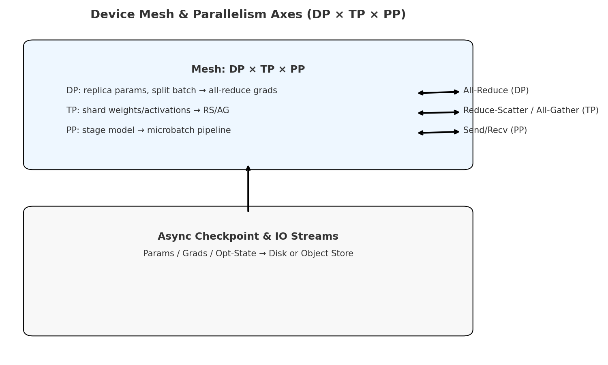
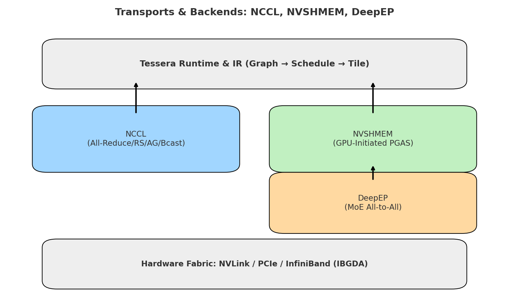
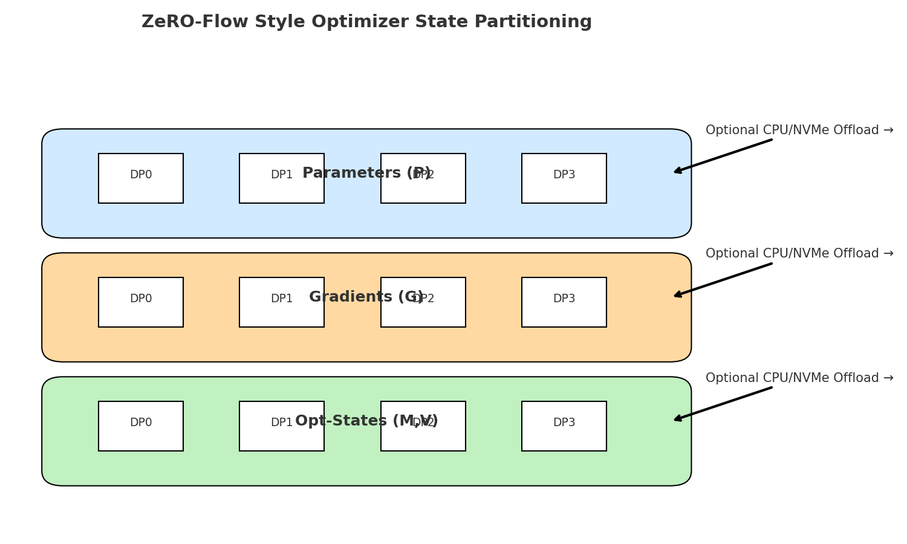

# Tessera Collectives & Distributed Systems Guide

This document **explains what Tessera’s distributed layer is**, **how it works**, and **how to use it** to scale training and inference across multi‑GPU and multi‑node systems. It combines **normative semantics** (determinism, ABI expectations) with **practical guidance** (performance tips, worked examples).

> **At a glance**: Tessera exposes a **device mesh** (`["dp","tp","pp"]`) and lowers distributed operators through a multi‑level IR (Graph → Schedule → Tile) to transport backends (NCCL, NVSHMEM, DeepEP). Deterministic collectives and stream‑ordered checkpoints give reproducibility.

---

## 1. What It Is (Overview)

- A unified **distributed execution model** centered on a named **device mesh** with axes for **Data Parallel (DP)**, **Tensor Parallel (TP)**, and **Pipeline Parallel (PP)**.
- A set of **deterministic collective semantics** (fixed reduction order and send/recv ordering on request).
- Multiple **transport backends**:
  - **NCCL** for dense collectives (all‑reduce, reduce‑scatter, all‑gather, broadcast).
  - **NVSHMEM** for **GPU‑initiated** one‑sided communication (PGAS) and fine‑grained overlap inside kernels.
  - **DeepEP** for optimized **MoE all‑to‑all** (built on NVSHMEM).

**Figures**  
**F1. Mesh & Parallelism Axes**  


**F2. Transports & Backends**  


---

## 2. How It Works (Architecture)

### 2.1 Device Mesh
A **Cartesian mesh** of devices with named axes. Operators annotate whether tensors are **sharded** or **replicated** along each axis via `ShardSpec`.

```python
from tessera import dist
mesh = dist.Mesh(axes=["dp","tp","pp"], devices=range(48))  # 4 dp × 4 tp × 3 pp
```

### 2.2 IR Lowering
- **Graph IR**: operator algebra adds **collective nodes** and shape/layout metadata.
- **Schedule IR**: fuses compute+collective stages, injects **streams** and **overlap**.
- **Tile IR**: maps to thread‑block/warp kernels; can insert **NVSHMEM puts/gets** from within persistent kernels.

### 2.3 Transport Selection
Per operator, Tessera picks a backend: **NCCL**, **NVSHMEM**, or **DeepEP** (or **auto**). Deterministic mode fixes reduction order and send/recv ordering.

---

## 3. How To Use It (API Surface)

### 3.1 Data Parallel (DP)
Replicate params on `dp`, split batch, **all‑reduce** grads.

```python
from tessera import dist, op
mesh = dist.Mesh(axes=["dp"], devices=range(8))

with dist.deterministic(reduce_tree="binary"):
    loss = op.cross_entropy(out, labels)
    grads = op.autodiff(loss)
    grads = dist.all_reduce(grads, axis="dp")
```

**Tips**: Large models prefer **reduce‑scatter → sharded optimizer** (ZeRO‑Flow style).

### 3.2 Tensor Parallel (TP)
Shard matmul/attention weights; use RS/AG where needed.

```python
from tessera import dist, op
mesh = dist.Mesh(axes=["tp","dp"], devices=range(16))
W = dist.tensor((H, 4*H), layout=dist.ShardSpec(partition=("col",), mesh_axes=("tp",)), mesh=mesh)
Y = op.matmul(X, W)                  # sharded GEMM
Y = dist.all_gather(Y, axis="tp")    # or fused epilogue gather
```

**Tips**: Favor **fused epilogues** (bias+activation) and **head‑parallel attention** when divisible.

### 3.3 Pipeline Parallel (PP)
Stage model across `pp` axis; schedule microbatches with 1F1B.

```python
from tessera import pipeline
stages = [b0,b1,b2,b3]
pipe = pipeline.compose(stages=4, assign=stages)

@pipeline.run(mesh_axes=("pp",), schedule="1F1B", microbatches=16)
def step(x):
    for b in stages: x = b(x)
    return x
```

**Tips**: Set **microbatches ≥ 2× stages** to reduce bubbles; balance stage FLOPs.

### 3.4 MoE with DeepEP/NVSHMEM
Use GPU‑initiated routing for small/irregular A2A traffic and overlap comm with compute.

```python
from tessera import op, dist, schedule
mesh = dist.Mesh(axes=["ep","dp"], devices=range(64))
y = op.moe(x, experts=experts, router="topk", k=2,
           transport={"type":"nvshmem","multi_qp":True,"pack_dtype":"fp8_e4m3"},
           deterministic=True, mesh=mesh)

@schedule(pipeline=True, overlap=True, comm_backend="nvshmem", epoch="soft")
def train_step(batch): return y
```

**Tips**: Enable **FP8** packed routing, tune **bucket size** and **multi‑QP**; use **epoch barriers** for reproducibility.

---

## 4. Deterministic Semantics (Normative)

- `deterministic=True` enforces:
  - **Fixed reduction tree** for collective ops.
  - **Ordered send/recv** at routing boundaries.
  - Disables numerically‑unstable fast paths.
- MoE routing epochs must end with a **stream‑ordered barrier** (e.g., `nvshmem_quiet`).

---

## 5. Async Checkpointing & Elasticity

### 5.1 Async Checkpointing
Stream‑ordered, crash‑consistent checkpoints with atomic manifests.

```python
from tessera import checkpoint
checkpoint.save(tag="step_100k",
                tensors=model.parameters(),
                optimizer=optimizer.state_dict(),
                atomic=True, async_io=True)
```

### 5.2 Elastic Collectives
Resize communicators at safe points; rehash MoE experts consistently.

```python
from tessera import dist
with dist.elastic(rejoin=True, safe_point="pipeline_boundary"):
    train_epoch()
```

**Figure**  
**F3. ZeRO‑Flow‑style partitioning**  


---

## 6. Best Practices (Pragmatic)

- Prefer **NCCL** for dense collectives; **NVSHMEM/DeepEP** for MoE A2A or fine‑grained exchanges.
- Use **reduce‑scatter grads → sharded optimizer** to reduce memory/traffic.
- **Autotune** pack sizes, warps per tile, and collective bucket sizes; persist per `(arch,dtype,shape)`.
- **Overlap** compute and comm with streams; consider **persistent kernels** for MoE/attention.
- For reproducibility, always set **deterministic mode** and lock **RNG seeds**.

---

## 7. Troubleshooting & Diagnostics

| Symptom | Likely Cause | Fix |
|---|---|---|
| `init`/QP errors (NVSHMEM/DeepEP) | Init order / missing GPUDirect RDMA | Initialize transport before kernels; verify driver/firmware |
| Collective hang | Mismatched participants / stream sync bug | Ensure same participants & stream‑ordered barriers |
| Low overlap | No persistent kernel or no comm warp | Enable persistent mode; dedicate a progress warp |
| Non‑determinism | Unordered sends or variable reduction tree | `deterministic=True`, set send order + fixed tree |
| Pipeline bubbles | Too few microbatches or stage imbalance | Increase microbatches; rebalance stage compute |

Enable logs:
```bash
TESSERA_COMM_TRACE=1 TESSERA_DETERMINISTIC=1 python train.py
```

---

## 8. Summary

Tessera’s distributed layer provides **clear semantics**, **portable performance**, and **practical controls** to scale models across GPUs and nodes—covering DP/TP/PP, deterministic collectives, async checkpointing, elastic training, and MoE‑optimized transports.
