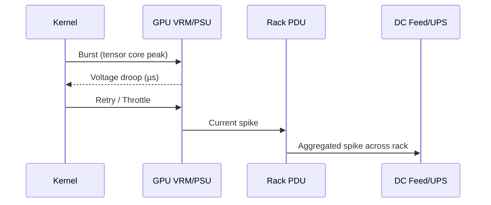

# Tessera Energy Efficiency & Sustainability Guide
**Status:** v1.0 (Informative & Practical)

This guide provides practical strategies to improve **energy efficiency**, **thermal behavior**, and **power integrity** for Tessera programs from single-GPU nodes to multi-rack deployments.

---

## 1. Introduction: Energy as a First-Class Constraint
Frontier-scale AI models can consume **megawatts**. Energy cost stems from:
- **Compute** (FLOPs) — tensor cores, vector units.
- **Communication** — NVLink/IB collectives.
- **Memory** — HBM/DDR access can rival compute energy.

**Programming model opportunity:** Make energy a first-class constraint alongside latency and accuracy.

---

## 2. Power-Aware Scheduling
Tessera’s Schedule IR accepts power targets and constraints and coordinates with backend DVFS/governors.

### Techniques
- **Adaptive Tiling**: Select tile sizes that achieve high utilization with minimal idle power.
- **Throughput-per-Watt policy**: Prefer schedules that maximize work/Joule over peak TFLOPs.
- **Job Co-scheduling**: Pack moderate jobs on fewer nodes to reduce idle and cooling losses.
- **DVFS Integration**: Lower clocks on memory-bound kernels to reduce watts with negligible slowdown.

### Example
```python
from tessera import schedule, op

@schedule(power_cap="275W", policy="throughput_per_watt", dvfs="auto")
def forward_step(X, W):
    return op.matmul(X, W)
```

---

## 3. Mixed-Precision vs Energy Trade-Offs
- **bf16/fp16/fp8** improve FLOPs/Watt (2–4× vs fp32) but may require more steps.
- **Dual-precision autodiff**: forward in bf16/fp8, backward/accum in fp32.
- **Error-bounded ops**: allow reduced precision if error ≤ ε.

```python
Y = op.matmul(A, B, precision="fp8", accumulate="fp32", error_tolerance=1e-3)
```

---

## 4. GPU Cluster Thermal Considerations
- **Thermal-aware placement**: choose “cool” nodes first.
- **Workload migration** on over-temp (requires checkpoint).
- **Cooling budget scheduling**: avoid hot aisles saturation.

```yaml
thermal_policy:
  hotspot_threshold: 85C
  redistribute: true
  prefer_cool_nodes: true
  migration_on_overheat: true
```

---

## 5. Energy-Efficient Collectives
- **Topology-aware routing**: minimize cross-switch hops.
- **Overlap comm/compute**: reduce idle watts.
- **Sparse collectives**: communicate only changed slices (e.g., MoE).

---

## 6. Memory & I/O Efficiency
- **Fusion** reduces DRAM round-trips.
- **In-place updates** via adjoint scheduling.
- **Activation checkpointing (energy-aware)**: recompute when FLOPs < bytes_energy.
- **Prefetch/pipelining** tuned to avoid cache thrash.

---

## 7. Monitoring & Instrumentation
- Power/thermal telemetry via NVML/ROCm-SMI/Level-Zero.
- Per-op energy accounting.

```python
from tessera import monitor

with monitor.energy_scope("training_epoch") as energy:
    run_training()
print("Energy (J):", energy.joules)
```

---

## 8. New Areas for Energy/Thermal Efficiency
- **Approximate computing**: stochastic rounding, lossy collective compression.
- **Thermal-aware graph transforms**: reorder ops to spread heat.
- **Dynamic precision scheduling**: higher precision early, lower later.
- **Heterogeneous utilization**: offload non-critical ops to CPUs.

---

## 9. Peak Current & Transient Management (Power Integrity)
High-efficiency kernels can create **short, intense power spikes** (high dI/dt) that stress **VRMs**, **PSUs**, **PDUs**, and **datacenter feeds**. These transients can cause **voltage droop**, **clock throttling**, **PSU over-current protection (OCP) trips**, or even **rack breaker trips**.

### 9.1 Phenomenology
- **Node-level**: GPU VRM droop → SM clock throttling; PCIe slot brownouts; PSU OCP trips under bursty loads.
- **Rack-level**: Synchronous bursts across nodes can exceed **PDU instantaneous limits**, causing breaker trips despite average power being within budget.
- **Datacenter-level**: Coordinated spikes increase **crest factor** and **harmonic content**, stressing UPS/transformers and cooling transients.



### 9.2 Detection & Debugging
- **Per-GPU telemetry**: instantaneous power (W), rail voltages, SM clocks, throttle reasons.
- **Node logs**: PSU OCP events, BMC/IPMI/Redfish.
- **Rack PDU**: peak current, crest factor, breaker near-trip events.
- **Correlate** with Tessera kernel timelines (launch/finish), collectives, and DVFS changes.

**Practice**
```python
from tessera import monitor, profile

with profile.session() as sess, monitor.power_trace(interval_ms=5) as pwr:
    Y = run_hotstep()           # attention/GEMM-heavy region
sess.timeline().correlate(pwr)  # aligns spikes to kernels/collectives
```

Checklist:
- [ ] Are spikes aligned with **collectives** or **kernel boundaries**?
- [ ] Do clocks **throttle** immediately after spikes?
- [ ] Do PDUs report **short over-current** or high **crest factor**?
- [ ] Is there **NVLink/PCIe** concurrency during spikes?

### 9.3 Mitigation Strategies

#### A. **Temporal Smoothing (Staggering & Jitter)**
- **Phase-shift** pipeline stages across nodes to avoid synchronized bursts.
- Add **randomized jitter** (±1–5 ms) at microbatch boundaries.
- **Stagger collectives** by mesh subgroups (e.g., offset tensor-parallel groups).

```yaml
power_shaper:
  jitter_ms: [1,5]
  phase_shift:
    dp_groups: "auto"          # stagger all-reduce across groups
    pp_stages: "round_robin"
  cap_rate: 0.85               # target 85% of PSU OCP
```

#### B. **Duty-Cycle Capping (Token-Bucket Watts)**
- Limit instantaneous concurrent **tensor-core** launches per node.
- Token-bucket on GPU **active warps** or **cp.async** in-flight ops.
- Guarantee average throughput while capping instantaneous draw.

```python
@schedule(power_cap="node:1.2kW", cap_policy="token_bucket", cap_window_ms=20)
def train_step(...): ...
```

#### C. **Collective Pacing & Hierarchical Synchronization**
- Pace **reduce-scatter/all-gather** to avoid rack-wide alignment.
- Use **hierarchical collectives** (intra-node first, inter-node second) with **time offsets** between nodes.

```python
Y = op.all_reduce(X, deterministic=True, phase="group_offset(tp)")
```

#### D. **DVFS Smoothing / Clock Shaping**
- Temporarily lower SM clocks during bursty regions; restore during memory-bound ops.
- Use **per-op DVFS hints** from Schedule IR.

```python
@schedule(dvfs="shape:sm_down_200MHz@flash_attention")
def step(...): ...
```

#### E. **Resource Mix & Load Shaping**
- Interleave **memory-bound** kernels between **compute-bound** kernels to lower instantaneous draw.
- Limit **cp.async** depth; bound concurrent **ldmatrix** waves.

```python
@schedule(cp_async_depth=2, warp_mma_concurrency=2)   # smooth peaks
```

#### F. **Rack/Datacenter-Level Controls**
- **Per-rack power caps** with admission control; queue launches to stay under cap.
- **Breaker margin** enforcement (e.g., keep below 80% of rating).
- Avoid synchronous job start (“**soft-start**” ramp over 30–120 s).

```yaml
rack_power_governor:
  rack_cap_kw: 20
  soft_start: 60s
  per_rack_jitter_ms: [10,50]
```

### 9.4 Validation
- Use **5–10 ms power traces** to verify spike reduction after shapers.
- Confirm **no throughput regression >2–5%** under caps.
- Ensure **no new stalls** (e.g., collective timeouts).

---

## 10. Best Practices (Quick List)
- Add **power/thermal objectives** to autotuning (not just latency).
- Prefer **hierarchical collectives with offsets** at cluster scale.
- Use **stagger + jitter + token-bucket** to tame spikes.
- Balance kernels: mix compute/memory-bound to reduce peaks.
- Adopt **soft-start** ramp for large jobs; avoid synchronized launches.
- Enforce **rack caps** and **breaker margins**; monitor crest factor.

---

## Appendix A — Measurement Tips
- Sample power at **≥5 ms** to catch spikes.
- Track **throttle reasons** (power, thermal, reliability).
- Compute **crest factor** (I_peak / I_rms); high values indicate spiky load.
- Correlate power with **kernel/collective timeline**.
