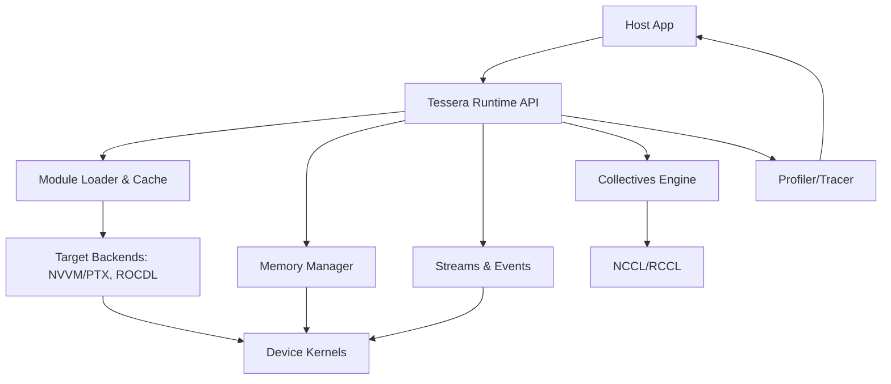

# Tessera Runtime & ABI Specification
*(CUDA‑style companion; **normative unless explicitly marked informative**)*

---

## 1. Scope

This document defines the **host runtime API**, **execution/runtime behavior**, and the **Application Binary Interface (ABI)** for Tessera programs. It covers:
- Host–device interaction (module loading, memory, streams/events, collectives).
- Launch and synchronization semantics with **determinism guarantees**.
- ABI: calling conventions, parameter layout, address spaces, alignment, and versioning.
- Interoperability with **MLIR → NVVM/PTX**, **MLIR → ROCDL/GCN**, and vendor collective libraries (NCCL/RCCL).
- C/C++ and Python bindings (surface API), and profiling/diagnostics hooks.

> Tessera HML and IR layers are specified elsewhere. This specification governs the **binary contracts** between compiled kernels, the runtime, and applications.

---

## 2. Terminology

- **Module**: A compiled artifact containing one or more device kernels and metadata (IR fingerprints, arch targets, ABI version).
- **Kernel**: A device-executable entry point produced from Tile IR.
- **Stream**: An ordered queue of work on a device/mesh axis.
- **Event**: A synchronization primitive within or across streams.
- **Mesh**: A collection of devices organized along logical axes (`tp`, `pp`, `dp`, `ep`).
- **Collective**: A multi-device operation (all-reduce, all-gather, reduce-scatter, broadcast) with deterministic order.
- **Policy**: Numerics/determinism settings (e.g., stable reductions, RNG policy).

---

## 3. Runtime Architecture (Informative)



The runtime mediates between the host application and device kernels, preserving **deterministic execution** across streams and collectives.

---

## 4. Host API Surface (C/C++)

### 4.1 Initialization & Context
```c
typedef struct tessContext* tessContext_t;
typedef struct tessMesh*    tessMesh_t;

typedef enum {
  TESS_OK = 0,
  TESS_ERR_INVALID_VALUE,
  TESS_ERR_OUT_OF_MEMORY,
  TESS_ERR_NOT_INITIALIZED,
  TESS_ERR_LAUNCH_FAILED,
  TESS_ERR_ARCH_MISMATCH,
  TESS_ERR_UNSUPPORTED,
  TESS_ERR_COLLECTIVE_MISMATCH,
  TESS_ERR_DETERMINISM_VIOLATION,
  TESS_ERR_TIMEOUT,
  TESS_ERR_ABI_VERSION_MISMATCH,
  TESS_ERR_CACHE_CORRUPT
} tessStatus_t;

tessStatus_t tessInit(tessContext_t* ctx);
tessStatus_t tessShutdown(tessContext_t ctx);
tessStatus_t tessGetVersion(int* major, int* minor, int* patch);
```

### 4.2 Mesh & Devices
```c
typedef struct { int tp, pp, dp, ep; } tessMeshAxes;
tessStatus_t tessMeshCreate(tessContext_t, const int* deviceIds, int nDevices,
                            tessMeshAxes axes, tessMesh_t* outMesh);
tessStatus_t tessMeshDestroy(tessMesh_t);
```

### 4.3 Streams & Events
```c
typedef struct tessStream* tessStream_t;
typedef struct tessEvent*  tessEvent_t;

tessStatus_t tessStreamCreate(tessMesh_t, int priority, tessStream_t*);
tessStatus_t tessStreamDestroy(tessStream_t);
tessStatus_t tessEventCreate(tessEvent_t*);
tessStatus_t tessEventDestroy(tessEvent_t);
tessStatus_t tessEventRecord(tessEvent_t, tessStream_t);
tessStatus_t tessStreamWaitEvent(tessStream_t, tessEvent_t);
tessStatus_t tessStreamSynchronize(tessStream_t);
```

### 4.4 Memory Management
```c
typedef enum { TESS_MEM_GLOBAL, TESS_MEM_PINNED_HOST } tessMemKind;
tessStatus_t tessMalloc(tessMesh_t, size_t bytes, void** devPtr);        // global HBM
tessStatus_t tessFree(tessMesh_t, void* devPtr);
tessStatus_t tessHostAlloc(size_t bytes, void** hostPtr, tessMemKind);
tessStatus_t tessHostFree(void* hostPtr);

typedef enum { TESS_COPY_H2D, TESS_COPY_D2H, TESS_COPY_D2D } tessCopyKind;
tessStatus_t tessMemcpyAsync(void* dst, const void* src, size_t bytes,
                             tessCopyKind kind, tessStream_t stream);
```

### 4.5 Modules & Kernels
```c
typedef struct tessModule* tessModule_t;
typedef struct tessKernel* tessKernel_t;

tessStatus_t tessModuleLoad(tessContext_t, const void* image, size_t size,
                            tessModule_t* outModule);   // fatbin / IR-pack
tessStatus_t tessModuleUnload(tessModule_t);

tessStatus_t tessKernelGet(tessModule_t, const char* name, tessKernel_t* out);

typedef struct {
  int grid[3];    // blocks
  int block[3];   // threads (compiler chooses defaults if zero)
  size_t shmemBytes;   // opt shared memory size hint
  unsigned flags;      // see §6
} tessLaunchConfig;

tessStatus_t tessLaunch(tessKernel_t, tessMesh_t, tessLaunchConfig cfg,
                        const void* argBuffer, size_t argSize, tessStream_t);
```

### 4.6 Collectives
```c
typedef enum { TESS_COLL_SUM, TESS_COLL_MAX, TESS_COLL_MIN } tessCollOp;

tessStatus_t tessAllReduce(tessMesh_t, void* buffer, size_t count, int dtype,
                           tessCollOp op, const char* axis, tessStream_t);
tessStatus_t tessReduceScatter(tessMesh_t, void* inout, size_t count, int dtype,
                               tessCollOp op, const char* axis, tessStream_t);
tessStatus_t tessAllGather(tessMesh_t, void* inout, size_t count, int dtype,
                           const char* axis, tessStream_t);
tessStatus_t tessBroadcast(tessMesh_t, void* buffer, size_t count, int dtype,
                           int root, tessStream_t);
```

### 4.7 Numerics & Determinism
```c
typedef struct {
  int   stableReductions;   // 1 = pairwise/Kahan enforced
  int   deterministic;      // 1 = fixed collective order
  int   rngStateless;       // 1 = stateless RNG
  int   allowFastMath;      // 0 = strict; 1 = opt-in (non-normative)
} tessNumericsPolicy;

tessStatus_t tessSetNumericsPolicy(tessContext_t, const tessNumericsPolicy*);
tessStatus_t tessGetNumericsPolicy(tessContext_t, tessNumericsPolicy*);
```

### 4.8 Profiling/Tracing
```c
typedef struct tessProfiler* tessProfiler_t;
tessStatus_t tessProfilerStart(tessContext_t, tessProfiler_t*);
tessStatus_t tessProfilerStop(tessProfiler_t, const char* outJsonPath);
```

---

## 5. Python Binding (Informative)

```python
import tessera as ts

ctx = ts.init()
mesh = ts.mesh(devices=range(8), axes=dict(tp=2, dp=4))

mod  = ts.module.load(open("model.fatbin","rb").read())
kern = mod.kernel["flash_attention_fused"]

argbuf = ts.pack_args(Q, K, V, O, B, H, L, D, scale=1.0)
ts.launch(kern, mesh, grid=(256,1,1), block=(128,1,1), args=argbuf, stream=ts.default_stream())

ts.collectives.all_reduce(mesh, grads, op="sum", axis="dp")
```

Bindings are 1:1 thin wrappers over the C ABI to ease interop with NumPy/PyTorch/JAX arrays (zero-copy when possible).

---

## 6. Launch Semantics & Flags (Normative)

- **Order**: Launches within a single stream execute **in order**.
- **Concurrency**: Distinct streams may execute concurrently if resources allow.
- **Determinism**: With `deterministic=1`, collective order and reduction trees are fixed.
- **Failure**: `tessLaunch` returns immediately; errors are reported via status and stream sync.

**Flags (bitfield)**:
- `TESS_LAUNCH_DEFAULT` = 0
- `TESS_LAUNCH_DETERMINISTIC` = (1<<0)  // override numerics policy per-launch
- `TESS_LAUNCH_CAPTURE` = (1<<1)        // capture for stream-graph replay
- `TESS_LAUNCH_PERSISTENT` = (1<<2)     // long-lived kernel (cooperative)
- `TESS_LAUNCH_LOW_LATENCY` = (1<<3)    // favor launch latency over throughput

---

## 7. Error Handling (Normative)

- Every API returns `tessStatus_t`. `TESS_OK` indicates success.
- **Synchronous errors**: invalid value, OOM, ABI mismatch, arch mismatch.
- **Asynchronous errors**: launch failed, collective mismatch, determinism violation (reported upon `tessStreamSynchronize`).

Recommended pattern:
```c
#define TCHK(x) do{ tessStatus_t s=(x); if(s!=TESS_OK) return s; }while(0)
```

---

## 8. Module Format & Loading (Normative)

### 8.1 Fatbin Container
A **Tessera fatbin** is a self-describing container:
- **Headers**: ABI version, arch targets, hash of source IR.
- **Sections**: PTX/NVVM bitcode, ROCDL bitcode, embedded metadata:
  - Kernel table (names → entry descriptors).
  - Parameter layouts (see §10).
  - Numerics policy defaults.
  - Collective plans (hints only; Schedule IR re-tunes per machine).

### 8.2 Caching & Reproducibility
- Compiled SASS/GCN and autotune results are cached per `(kernel, shape, dtype, arch)`.
- Cache invalidated on arch/driver/ABI hash change.
- Deterministic launches MUST ignore cache entries with different numerics policy.

---

## 9. Memory Model & Address Spaces (Normative)

Tessera adopts LLVM address space conventions:

| Space | Purpose                 | LLVM | NVVM | ROCDL |
|------:|-------------------------|-----:|-----:|------:|
| 0     | Generic (ptr casts)     |   0  |  0   |   0   |
| 1     | Global (HBM)            |   1  |  1   |   1   |
| 3     | Shared (SMEM/LDS)       |   3  |  3   |   3   |
| 4     | Constant                |   4  |  4   |   4   |
| 5     | Local (stack spills)    |   5  |  5   |   5   |

**Alignment**: Scalars align to their size; parameter buffer aligns to **8 bytes** minimum; vectorized loads follow backend rules (e.g., 16B for `ldmatrix`).

---

## 10. Kernel Calling Convention (Normative)

### 10.1 Parameter Buffer Layout
- All kernel arguments are **packed** into a contiguous **parameter buffer**.
- **Endianness**: little-endian.
- **Alignment**: each argument aligned to `min(sizeof(arg), 8)`; buffer size rounded up to 8 bytes.

#### Example
Kernel signature:
```
flash_attention(Q*, K*, V*, O*, int B, int H, int L, int D, float scale)
```
Parameter buffer (offsets in bytes):
```
0x00: Q (ptr, 8)     0x08: K (ptr, 8)
0x10: V (ptr, 8)     0x18: O (ptr, 8)
0x20: B (i32, 4)     0x24: H (i32, 4)
0x28: L (i32, 4)     0x2C: D (i32, 4)
0x30: scale (f32,4)  0x34: pad (4) → total 0x38
```

### 10.2 Return Values
- Kernels **do not** return values; results are written via pointers.
- Device functions (intra-module) follow target backend CC (NVVM/ROCDL).

### 10.3 Name Mangling
- Public kernel names are **C identifiers** (no C++ mangling).
- Device functions MAY be mangled internally (backend-dependent).

---

## 11. Determinism ABI (Normative)

- A **determinism descriptor** is attached to each launch:
  - Reduction order (fixed tree).
  - RNG seed + stream.
  - Stable math toggles (softmax, log-sum-exp, clamp).
- Collectives must consume the same descriptor across all participants or error with `TESS_ERR_DETERMINISM_VIOLATION`.

---

## 12. Streams, Events & Graph Capture (Normative)

- **Streams**: In-order execution; priority hints MAY influence scheduling.
- **Events**: May be recorded and waited across streams (same device or mesh).
- **Graph Capture**: With `TESS_LAUNCH_CAPTURE`, a stream records a DAG of launches and copies that can be **instantiated** and **replayed** (deterministically).

---

## 13. Collectives & Topology (Normative)

- Collectives execute with **fixed ordering** and **topology-aware** algorithms.
- Supported algorithms: ring, tree, hierarchical (NVSwitch-aware).
- The runtime selects the algorithm via:
  1) Sched IR hint → 2) Autotuner result → 3) Safe default.
- Mixed-precision on-wire quantization (e.g., FP8) is permitted **only if the current numerics policy allows it**.

---

## 14. Interoperability (Informative)

- **CUDA**: kernel modules can embed PTX; runtime loads via CUDA Driver API under the hood where applicable.
- **ROCm**: analogous via HIP/ROCr toolchain.
- **NCCL/RCCL**: Tessera collectives map to vendor libraries with **deterministic** settings.
- **MLIR**: Graph/Tile IR lower through standard `gpu`, `nvvm`, `rocdl`, `llvm` dialects.

---

## 15. Security & Sandboxing (Informative)

- Module signatures and IR hashes prevent cache poisoning.
- Optional module signing and runtime policy: disallow `fastmath`, enforce determinism.
- Memory limits per stream; persistent kernels require explicit flag.

---

## 16. Versioning & Compatibility (Normative)

- ABI version tuple `(major, minor)` embedded in fatbin header.
- Major changes **break** compatibility; minor are additive.
- Runtime rejects modules with incompatible ABI (`TESS_ERR_ABI_VERSION_MISMATCH`).

---

## 17. Diagnostics & Profiling (Informative)

- Profiler timestamps: enqueue, start, stop, copy bandwidth, kernel occupancy.
- JSON trace export (Chrome trace format) for integration with Nsight/rocprof.
- `tessExplain(module)` dumps fusion groups, tile shapes, collective plans.

---

## 18. Minimal End-to-End Example (C)

```c
tessContext_t ctx; tessInit(&ctx);
tessMesh_t mesh; int devs[8]={0,1,2,3,4,5,6,7};
tessMeshCreate(ctx, devs, 8, (tessMeshAxes){.tp=2,.pp=1,.dp=4,.ep=0}, &mesh);

tessStream_t s; tessStreamCreate(mesh, /*priority=*/0, &s);

void* Q; tessMalloc(mesh, Q_BYTES, &Q);
void* K; tessMalloc(mesh, K_BYTES, &K);
void* V; tessMalloc(mesh, V_BYTES, &V);
void* O; tessMalloc(mesh, O_BYTES, &O);

tessModule_t mod;
tessModuleLoad(ctx, fatbin_image, fatbin_size, &mod);
tessKernel_t ker;
tessKernelGet(mod, "flash_attention_fused", &ker);

struct { void* Q; void* K; void* V; void* O; int B,H,L,D; float scale; } args = {Q,K,V,O,B,H,L,D,1.0f};
tessLaunchConfig cfg = { .grid={256,1,1}, .block={128,1,1}, .shmemBytes=0, .flags=TESS_LAUNCH_DETERMINISTIC };
tessLaunch(ker, mesh, cfg, &args, sizeof(args), s);

tessStreamSynchronize(s);
tessStreamDestroy(s);
tessModuleUnload(mod);
tessFree(mesh, Q); tessFree(mesh, K); tessFree(mesh, V); tessFree(mesh, O);
tessMeshDestroy(mesh);
tessShutdown(ctx);
```

---

## 19. Appendices

### A. Error Codes
| Code | Meaning |
|------|--------|
| `TESS_OK` | Success |
| `TESS_ERR_INVALID_VALUE` | Invalid argument or configuration |
| `TESS_ERR_OUT_OF_MEMORY` | Allocation failed |
| `TESS_ERR_NOT_INITIALIZED` | Context/mesh not initialized |
| `TESS_ERR_LAUNCH_FAILED` | Kernel launch failed (see logs) |
| `TESS_ERR_ARCH_MISMATCH` | Module lacks target for this device |
| `TESS_ERR_UNSUPPORTED` | Operation not supported on this arch |
| `TESS_ERR_COLLECTIVE_MISMATCH` | Participants disagree on plan/policy |
| `TESS_ERR_DETERMINISM_VIOLATION` | Numeric policy violated at runtime |
| `TESS_ERR_TIMEOUT` | Operation exceeded configured timeout |
| `TESS_ERR_ABI_VERSION_MISMATCH` | Incompatible module ABI |
| `TESS_ERR_CACHE_CORRUPT` | Persistent cache failed validation |

### B. DType IDs (ABI)
| Name | ID |
|------|----|
| `fp8_e4m3` | 1 |
| `fp8_e5m2` | 2 |
| `fp16` | 3 |
| `bf16` | 4 |
| `fp32` | 5 |
| `fp64` | 6 |
| `int8` | 7 |
| `int16` | 8 |
| `int32` | 9 |
| `int64` | 10 |
| `bool` | 11 |
| `complex64` | 12 |
| `complex128` | 13 |

### C. Environment Variables (Informative)
- `TESS_NUMERICS=strict|promote|downcast`
- `TESS_DETERMINISTIC=1`
- `TESS_CACHE_DIR=/path/to/cache`
- `TESS_AUTOTUNE=0|1`
- `TESS_LOG_LEVEL=info|debug|trace`

---

**End of Tessera Runtime & ABI Specification**.
