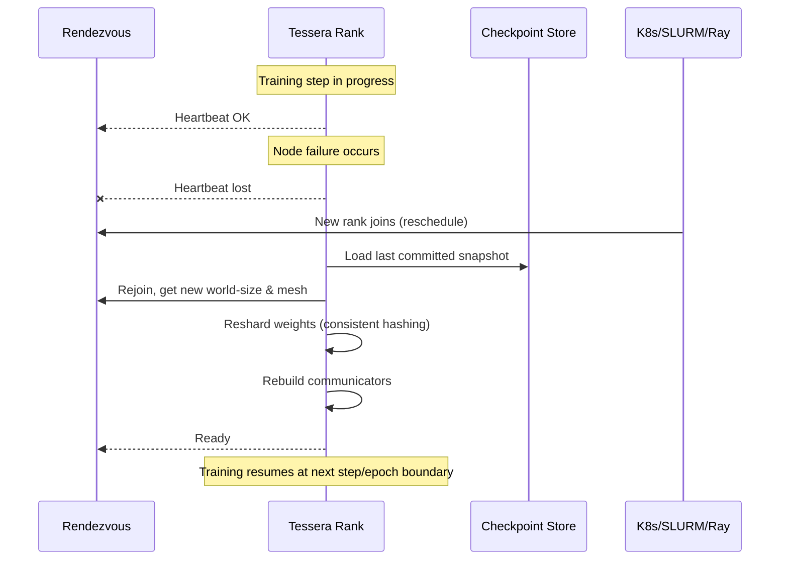

# Tessera Fault Tolerance & Elasticity Guide
**Status:** v1.0 (Informative & Practical)

This guide explains how Tessera handles **node failures**, integrates **checkpointing** at the IR/runtime levels, and interoperates with **elastic training frameworks** (e.g., TorchElastic-like rendezvous, Ray/K8s/SLURM). It provides practical recipes, APIs, and policies to achieve resilient training and serving.

---

## 1. Goals & Scope
- Survive **GPU/process/node failures** without losing training progress.
- Support **elastic world size** (adding/removing workers at runtime).
- Provide **fast, consistent checkpointing** integrated with Tessera IR.
- Maintain **determinism** when required; provide reproducible replays.
- Interoperate cleanly with orchestration stacks (Kubernetes, SLURM, Ray).

**Out of scope:** Business continuity of external systems (object stores, metadata DBs) and cluster scheduler HA.

---

## 2. Failure Model & Assumptions
Tessera considers the following faults:
- **GPU/Process crash:** OOM, illegal memory access, driver reset.
- **Node loss:** power/network outage, kernel panic.
- **Network faults:** latency spikes, partitions, dropped collectives.
- **Preemption:** spot/low-priority nodes evicted with short notice.
- **Partial degradation:** thermal throttling, link down (reduced bandwidth).

**Assumptions**
- Durable storage (e.g., S3, GCS, NFS) is available for checkpoints.
- Cluster manager can reschedule pods/daemons and rejoin rendezvous.
- Tessera deterministic mode can be enabled to guarantee bitwise replay across restarts when needed.

---

## 3. Node Failure Handling in Distributed Jobs

### 3.1 Detection & Containment
- **Health signals:** heartbeat from each rank, GPU/driver health (NVML/ROCm-SMI), communicator liveness.
- **Collective timeouts:** classify failures (peer loss vs congestion).
- **Containment:** cancel in-flight step, **drain pipeline**, preserve consistent state snapshot (activations may be discarded).

```python
from tessera import dist, fault

dist.config(collective_timeout_s=60, heartbeat_ms=500)

@fault.on_failure(policy="drain_then_resume")  # other: "fail_fast", "pause_for_manual"
def train_step(batch):
    out = model(batch["x"])
    loss = op.cross_entropy(out, batch["y"])
    loss.backward()
    optimizer.step()
```

### 3.2 Recovery Strategies
- **Fail-fast:** Abort job; rely on scheduler to relaunch everywhere.
- **Graceful degrade:** Temporarily shrink world size (drop ranks) and continue.
- **Elastic resume:** Re-form groups with new ranks (scale up/down), **reshard** state, resume from last consistent **step checkpoint**.

```python
with dist.elastic(rendezvous="k8s://tessera-rdzv", min_ranks=16, max_ranks=256):
    run_training()  # world size may change between epochs/steps
```

### 3.3 Mesh Reconfiguration & Resharding
Tessera re-maps `dist.Mesh(axes=[dp,tp,pp])` when ranks change:
- **DP (data parallel):** reduce-scatter/all-reduce groups recomputed.
- **TP (tensor parallel):** weight shards rebalanced; may require all-gather/reshard.
- **PP (pipeline):** stages regrouped; microbatch schedule adjusted to minimize bubble.

Resharding policy:
- **Consistent hashing** for sharded params/MoE experts to minimize movement.
- **Warm restart**: preload shard metadata and lazy-fetch missing shards.

```python
dist.reshard(policy="consistent_hash", migrate_async=True)
```

### 3.4 Determinism Considerations
- If **deterministic mode** is enabled, Tessera persists **reduction tree** and **RNG streams** in checkpoint metadata and **replays** the same schedule after recovery.
- Elastic resizing changes math order; enforce **epoch boundary** resizing when strict reproducibility is required.

---

## 4. Checkpointing Integration (IR/Runtime)

### 4.1 What Gets Checkpointed
- **Model parameters** (sharded by Mesh axes).
- **Optimizer state** (supports ZeRO-style partitioning).
- **Autotune cache** (per arch/shape/dtype) for fast warm-up.
- **RNG state** (per-rank) and **deterministic reduction plan** (tree/ring).
- **Graph IR capture** metadata (for CUDA Graphs / launch replay).
- Optional: **Data loader** offset/epoch/seed; **KV cache** for inference.

### 4.2 Consistency & Barriers
- Tessera inserts a **graph-level barrier** to reach a quiescent point.
- Uses **two-phase commit**: write shards → write manifest → publish atomic `COMMITTED` marker.
- On restart, runner loads the **last committed** manifest.

```python
from tessera import checkpoint

# Save a sharded checkpoint
checkpoint.save(
    tag="step_120000",
    tensors=model.parameters(),
    optimizer=optimizer.state_dict(),
    mesh=dist.current_mesh(),
    atomic=True
)

# Load with automatic desharding/resharding
state = checkpoint.load("step_120000", remap_to=dist.current_mesh())
model.load_parameters(state.tensors)
optimizer.load_state_dict(state.optimizer)
```

### 4.3 Incremental & Async Checkpointing
- **Delta checkpoints:** store diffs from base snapshot to reduce IO.
- **Async streaming:** offload writes to background I/O thread; throttle to avoid training stall.
- **Bandwidth-aware:** coordinate with collectives; avoid checkpoint during heavy all-reduce windows.

```python
checkpoint.enable_async(max_bandwidth_gbps=4.0, flush_interval_s=5)
```

### 4.4 Formats & Layout
- Directory layout: one manifest + per-shard files (`tpX_ppY_dpZ.safetensors`).
- Metadata includes: tensor dtypes, shapes, sharding plan, RNG seeds, reduction plan ID, backend info, numerics profile.

---

## 5. Integration with Elastic Training Frameworks

### 5.1 Rendezvous & Membership
Tessera exposes a **rendezvous adapter** API compatible with etcd/Redis/K8s headless services. The adapter manages **rank assignment**, **group formation**, and **world-size changes**.

```python
from tessera import elastic

elastic.configure(
  backend="k8s",          # "etcd" | "redis" | custom
  group="exp-gpt-oss",
  min_ranks=64,
  max_ranks=256,
  rebalance_on_join=True,
  rebalance_on_exit=True
)
```

### 5.2 Elastic Schedulers & LR Scaling
- **Global batch size** adjusted with world size; apply **linear LR scaling** or custom schedule.
- **Gradient accumulation** auto-tuned to maintain effective batch.

```python
from tessera import train

train.elastic_config(
  adjust_lr="linear",
  grad_accum_auto=True,
  resize_at="epoch",   # or "step" with non-deterministic allowance
)
```

### 5.3 Orchestrators
- **Kubernetes:** StatefulSets/Jobs, readiness gates on rendezvous, PodDisruptionBudgets for preemption control.
- **SLURM:** srun scontrol requeue hooks; elastic partitions.
- **Ray:** Placement groups; actor restarts with Tessera elastic adapter.

### 5.4 Heterogeneous Clusters
- When hardware changes (e.g., sm_90 ↔ sm_100), Tessera **invalidates/retunes** autotune cache and **remaps** kernels accordingly; checkpoint is hardware-agnostic.

```python
elastic.on_topology_change(retune_autotuner=True, invalidate_kernels=True)
```

---

## 6. Advanced Elastic Patterns

### 6.1 Preemption Handling
- **Signal capture** (SIGTERM) triggers **graceful checkpoint** within grace period.
- **Partial flush** if time-constrained; resume with delta replay.

```python
fault.on_preempt(grace_s=30, action="checkpoint_then_exit")
```

### 6.2 Elastic Mixture-of-Experts (MoE)
- **Expert shards** mapped via consistent hashing; routing table versioned.
- On resize, only move a minimal set of experts; routes updated atomically.

```python
moe.rehash(keep_fraction=0.9, atomic=True)
```

### 6.3 Elastic Pipeline Parallelism
- Rebalance **pp stages** to equalize compute time as world size changes.
- Adjust microbatch count to maintain utilization and minimize bubbles.

```python
pipeline.rebalance(target_skew_ms=2.5)
```

### 6.4 Hierarchical Elastic Collectives
- Intra-node groups stabilized; inter-node resized first to preserve local efficiency.
- **Offset scheduling** of inter-node collectives to limit power spikes (see Energy Guide).

---

## 7. Observability for Fault Tolerance
Track and alert on:
- **Failure events:** rank lost, retry counts, partition healed.
- **Recovery time:** MTTR per failure type.
- **Checkpoint metrics:** duration, bandwidth, age (RPO).
- **Elastic resizes:** new world size, reshard bytes moved, autotune retune duration.
- **Determinism:** divergence flags vs last known good checksum.

```python
from tessera import monitor

monitor.emit({
  "event": "elastic_resize",
  "world_size": dist.world_size(),
  "reshard_mib": stats.reshard_bytes/2**20
})
```

---

## 8. Testing & Validation (Failure Injection)
- **Drop rank** during all-reduce → verify elastic regroup or rollback.
- **Kill node** mid-pipeline → ensure drain + resume from last checkpoint.
- **Network partition** → detect, timeout, re-form groups.
- **Preemption** → checkpoint before eviction; resume cleanly.

```python
from tessera import fault

with fault.inject(drop_device=3):
    train_step(batch)

with fault.inject(network_partition=[(0,64)]):
    op.all_gather(X)
```

---

## 9. API Quick Reference (Selected)
```python
# Failure handling
fault.on_failure(policy="drain_then_resume")
fault.on_preempt(grace_s=30, action="checkpoint_then_exit")

# Elastic runtime
dist.elastic(rendezvous="k8s://tessera-rdzv", min_ranks=64, max_ranks=256)
dist.reshard(policy="consistent_hash", migrate_async=True)

# Checkpoint
checkpoint.save(tag="step_1000", atomic=True)
state = checkpoint.load("step_1000", remap_to=dist.current_mesh())
checkpoint.enable_async(max_bandwidth_gbps=4.0, flush_interval_s=5)

# Training adjustments
train.elastic_config(adjust_lr="linear", grad_accum_auto=True, resize_at="epoch")
pipeline.rebalance(target_skew_ms=2.5)
moe.rehash(keep_fraction=0.9, atomic=True)
```

---

## 10. Recovery Flow (Sequence Diagram)



---

## 11. Best Practices Checklist
- [ ] Use **atomic, sharded checkpoints** with two-phase commit.
- [ ] Resize at **epoch boundaries** for strict determinism.
- [ ] Prefer **consistent hashing** for minimal reshard movement.
- [ ] Enable **async/delta checkpoints** to reduce IO stalls.
- [ ] Integrate with **rendezvous** for rapid regroup after failures.
- [ ] Monitor **MTTR, checkpoint age (RPO), and reshard bytes moved**.
- [ ] Test with **failure injection** before production.

---

## 12. Appendix: Checkpoint Manifest (Example)
```yaml
version: 1
step: 120000
backend: ptx
mesh: { dp: 16, tp: 8, pp: 4 }
numerics: deterministic
rng:
  seeds: { global: 1234, per_rank: ... }
reduce_tree_id: ring-16x8x4-v3
parameters:
  - name: transformer.w_qkv
    shape: [8192, 24576]
    dtype: bf16
    sharding: { axis: ["tp"], part: 8 }
    shards:
      - path: ckpt/transformer.w_qkv.tp0.safetensors
      - path: ckpt/transformer.w_qkv.tp1.safetensors
      # ...
optimizer:
  type: adamw
  partitioning: zero_stage_2
  shards: [...]
autotune_cache:
  arch: sm90
  entries: 1824
```

---

**Summary:** With built-in failure detection, elastic meshes, atomic sharded checkpoints, and rendezvous adapters, Tessera provides a practical toolbox for **fault-tolerant** and **elastic** large-scale training and serving.
