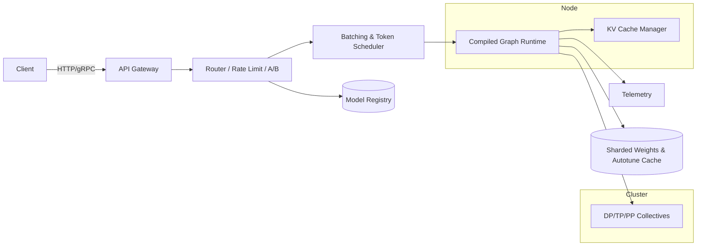

# Tessera Inference Server Guide
*(Design & operations manual for production inference using Tessera — CUDA‑style documentation)*

**Status:** v1.0 (Informative with Normative sections noted)  
**Audience:** Platform engineers, ML infra, model authors

---

## 1. Overview

The **Tessera Inference Server (TIS)** is a high‑performance model serving stack built on Tessera’s multi‑level IR (Graph → Schedule → Tile → Target), enabling:
- Compiled, **shape‑specialized** graphs with autotuned schedules
- **Distributed execution** across DP/TP/PP meshes (single node to multi‑node)
- Low‑latency **continuous batching** for LLMs, speculative decoding, paged KV caches
- **Quantization** (BF16/FP16/FP8/INT8) with safe fallbacks and fp32 accumulation where required
- Production **APIs** (HTTP/gRPC) compatible with OpenAI‑style endpoints
- **Observability**, **multi‑tenancy**, and **SLA/SLO** controls

TIS uses Tessera operators (e.g., `op.flash_attention`) and the runtime’s portability (PTX/ROCm/Level‑Zero/CPU).

---

## 2. Goals & Non‑Goals (Normative)

**Goals**
- **Predictable latency** under load via continuous batching and admission control.
- **Deterministic numerics** option for regulatory workloads.
- **Seamless scale‑out** via distributed meshes and collective semantics.
- **Hot‑swap models** with versioned registries and rolling upgrades.

**Non‑Goals**
- Training orchestration (covered elsewhere).
- Long‑running DAG schedulers; TIS focuses on online inference paths.

---

## 3. Architecture Overview



**Key components**
- **API Gateway**: HTTP/gRPC, authN/Z, request shaping, streaming.
- **Router**: Multi‑model routing, A/B, canary, cost‑aware placement.
- **Scheduler**: Microbatch/continuous batching, token scheduler, priority lanes.
- **Executor**: Loads **Tessera packages** (*.tspkg) and runs compiled graphs.
- **KV Cache Manager**: Paged KV (HBM ↔ Host), sharing across sessions.
- **Collectives**: NCCL/RCCL/oneCCL/MPI per mesh policy.
- **Registry**: Versioned model store with IR artifacts + autotune caches.

---

## 4. Model Packaging (.tspkg)

A **Tessera package** is a self‑contained artifact:
```
model.tspkg/
  manifest.yaml
  graph_ir.tssa              # Graph IR module (or serialized MLIR)
  schedule_cache/            # Autotuner configs per (arch, shape, dtype)
  tile_kernels/              # Precompiled Tile/Target code objects (optional)
  weights/
    shard_tp0_pp0.safetensors
    shard_tp1_pp0.safetensors
    ...
  tokenizer/
  assets/
```

**Manifest (normative fields)**
```yaml
name: gpt-oss-7b
version: 1.3.2
entry: main.decode_graph         # symbol in Graph IR
mesh: { tp: 2, pp: 1, dp: 1 }
dtypes: [bf16, fp16, fp32]
kv_cache:
  pages: 256
  page_size: 2MiB
  swap: host_pinned
autotune:
  required: true
  min_arch: sm90
compat:
  api: openai-v1
```

---

## 5. Runtime Backends & Placement

- **Backends**: PTX (NVIDIA), ROCm (AMD), Level Zero (Intel), CPU.
- **Placement**: The router chooses nodes by **capabilities** (TensorCores/FP8, HBM size, NVLink domain) exposed via `runtime.capabilities()`.
- **Compilation**: On first load, TIS validates IR, loads precompiled kernels (if present), or JITs with autotune; results stored in **autotune cache** (persisted by model+arch+shape).

---

## 6. Scheduling & Batching

### 6.1 Continuous/Token Batching (LLM)
- Merge compatible requests into microbatches each decode step.
- Dynamic batch resizing with **latency SLO targets**.
- **Speculative decoding**: draft model + verify model; auto‑fallback.

### 6.2 Sequence Batching
- For encoder‑only workloads (embeddings), batch by request size and maximum padding budget.

### 6.3 Priority & QoS
- Priority lanes (`p0, p1, p2`), max occupancy per lane, **preemption at sequence boundaries**.

### 6.4 Kernel Graph Capture
- Use Tessera’s Graph IR capture → CUDA Graphs (PTX) / stream‑ordered launchers for low overhead.
- Shape bucketing to maximize capture reuse.

---

## 7. Memory Management & KV Cache

- **Paged KV Cache**: fixed‑size pages in HBM; LRU/clock replacement; spill to pinned host memory if needed.
- **Cross‑request cache sharing**: opt‑in reuse for continued chats.
- **Attention Kernel**: prefers **FlashAttention** (tiled, smem) with **fp32 accum** by default for stability.
- **Weights**: lazily mapped; TP shards pinned on first access; background prefetch for next layers.
- **NUMA & P2P**: enable NVLink/NVSwitch P2P, peer access, and topology‑aware shard placement.

---

## 8. Quantization & Formats

- **BF16/FP16** standard; **FP8** path if hardware supports (guard via capabilities).
- **INT8** weight‑only or activation‑aware quantization; per‑channel scales.
- **Dequant fusion**: fused into matmul epilogues via Schedule IR.
- **Calibration**: offline tools write scales into `manifest.yaml`; runtime can refine with amax observers if allowed.

---

## 9. Distributed Execution

- Mesh axes: **TP × PP × DP**.  
- **Collectives**: deterministic trees for all‑reduce/reduce‑scatter/all‑gather; overlap with compute using `async=True` when safe.  
- **Pipeline**: stage balance + bubble minimization; Gpipe‑style microbatching.  
- **Sharding**: tensor layouts encoded in ShardSpec; verifier enforces consistency.

---

## 10. APIs

### 10.1 REST (OpenAI‑compatible subset)
`POST /v1/chat/completions`
```json
{
  "model": "gpt-oss-7b",
  "messages": [{"role":"user","content":"Hello"}],
  "temperature": 0.7,
  "stream": true,
  "max_tokens": 256
}
```

**Streaming**: Server‑Sent Events (`text/event-stream`) or WebSocket frames.  
**Other endpoints**
- `/v1/completions`
- `/v1/embeddings`
- `/v1/healthz` (readiness/liveness)
- `/v1/models` (list/describe)
- `/v1/tokenize`

### 10.2 gRPC
- Unary and bidirectional streaming services: `Generate`, `Embed`, `Tokenize`, `Admin`.
- Flow control hints (credits per client).

---

## 11. Observability & SRE

- **Metrics** (Prometheus): p50/p90/p99 latency (end‑to‑end and per stage), throughput, GPU util, HBM usage, KV cache hit %, batch size, tokens/sec, failed requests, OOM counters.
- **Tracing** (OpenTelemetry): spans for queueing → batching → graph launch → collectives.
- **Logs**: per‑request sampling; redaction policies; anomaly detection (NaN/Inf via `op.check_numerics`).

---

## 12. Security & Multi‑Tenancy

- **AuthN/Z**: mTLS or OIDC; per‑tenant quotas; rate limits per API key.
- **Isolation**: process‑level isolation per tenant/model; MIG/GPU partitioning optional.
- **Sandbox**: no arbitrary device code at runtime; only pre‑approved operators and packages.

---

## 13. Deployment Patterns

### 13.1 Single Node (NVLink domain)
- 8×H100/GB200 node; one process with 8 executors bound per GPU; shared communicator.

### 13.2 Multi‑Node (NVSwitch/IB)
- Mesh spans nodes; use NCCL/RCCL/oneCCL with IB/RoCEv2; deterministic collectives required.

### 13.3 Kubernetes Example
```yaml
apiVersion: apps/v1
kind: Deployment
metadata: { name: tessera-inference }
spec:
  replicas: 2
  template:
    spec:
      containers:
      - name: server
        image: tessera/tis:1.0
        args: ["--config=/etc/tis.yaml"]
        resources:
          limits:
            nvidia.com/gpu: 8
        volumeMounts:
        - { name: config, mountPath: /etc }
      volumes:
      - name: config
        configMap: { name: tis-config }
```

**Config (`tis.yaml`)**
```yaml
server:
  port: 8080
  backend: ptx
  numerics: deterministic
models:
  - package: s3://models/gpt-oss-7b.tspkg
    mesh: { tp: 2, pp: 1, dp: 1 }
    instances: 2
scheduler:
  target_p99_ms: 150
  max_batch_tokens: 2048
  speculative:
    enabled: true
    draft_model: gpt-oss-1b
kv_cache:
  pages: 4096
  page_size: 2MiB
  spill: host_pinned
observability:
  prometheus: { path: /metrics }
  otlp: { endpoint: http://otel-collector:4317 }
security:
  auth: oidc
```

---

## 14. Performance Playbook

- **Capture CUDA Graphs** for hot shapes; bucket by `seq_len` and head dims.
- **Autotune schedules** per arch; persist cache; warm‑up on startup.
- **Pinned host memory** for KV spill; overlap DMA with compute.
- **Coalesce collectives**; use reduce‑scatter/gather patterns for TP layers.
- **Quantize** with fp8 or int8 when HW supports; keep accum fp32.
- **Avoid warp‑size assumptions**; use Tessera tile groups and reductions.

---

## 15. Failure Modes & Recovery

- **OOM** → shrink batch/max tokens; evict cold KV pages; degrade to bf16/fp16.
- **Collective timeout** → abort batch; reset communicator; quarantine node.
- **Autotune miss** → fallback to safe schedule; queue background tuning job.
- **NaN/Inf** → reset request; log prompt; enable strict numerics.

---

## 16. Example: Minimal Python Server (Skeleton)

```python
from tessera import server, dist, runtime, graph, op

app = server.App(config="tis.yaml")

@app.model("/models/gpt-oss-7b")
def load_model(pkg):
    mod = server.load_package(pkg)         # loads Graph IR + weights
    graph.capture(mod.entry, bucket_by=["seq_len"])
    return mod

@app.route("/v1/chat/completions", stream=True)
def chat(req):
    sched = server.scheduler(policy="continuous_batch", target_p99_ms=150)
    with sched.session(model="gpt-oss-7b") as sess:
        for delta in sess.generate(req.messages, max_tokens=req.max_tokens):
            yield delta  # SSE / gRPC stream

if __name__ == "__main__":
    app.run()
```

---

## 17. Compatibility & Portability

- Follows **Portability Guide** for backend selection and capability guards.  
- OpenAI‑style APIs provide client compatibility; adapters for Triton/MLServer optional.  
- HF Transformers loaders available for tokenizer + safetensors import into `.tspkg`.

---

## 18. Roadmap

- **Speculative multi‑draft** (tree‑based) with optimal verifier scheduling.  
- **KV compression** (Q/K/V low‑rank) for long contexts.  
- **Heterogeneous placement** (CPU offload for prefill, GPU for decode).  
- **Multi‑tenant fairness**: WFQ/DRR schedulers with per‑tenant budgets.

---

### Appendix A — Model Conversion (HF → .tspkg)
```bash
tessera pack   --from-hf gpt2   --name gpt-oss-7b   --dtype bf16   --mesh "tp=2,pp=1,dp=1"   --out model.tspkg
```

### Appendix B — Health & Metrics
- `/healthz` returns 200 when IR loaded, communicator ready, and batcher live.
- `/metrics` exports Prometheus counters/gauges/histograms for SRE dashboards.
