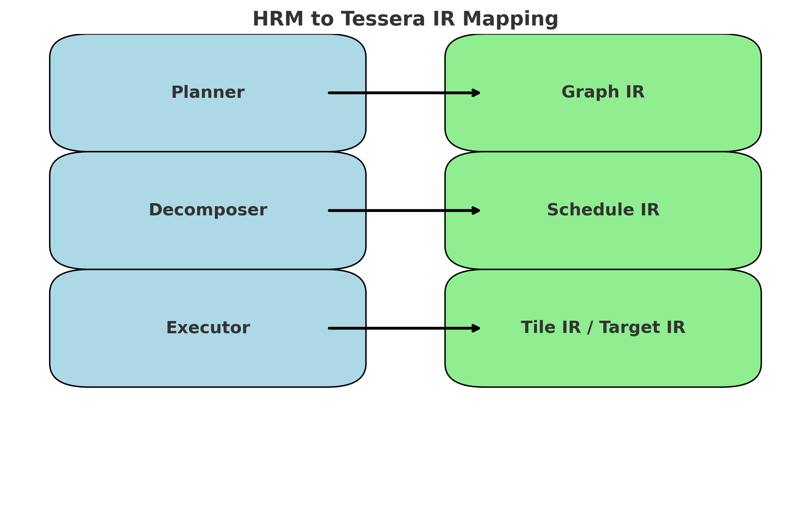

# Tessera–HRM Mapping Guide

This document describes how the **Hierarchical Reasoning Model (HRM)** framework maps onto the **Tessera programming model**, leveraging its multi-level IR stack (Graph IR → Schedule IR → Tile IR → Target IR).

---

## 1. HRM Overview

- **HRM** (Hierarchical Reasoning Model) provides a structured approach for reasoning tasks.
- It organizes reasoning into multiple **levels**:
  - **Local Inference**: Fine-grained symbolic or neural reasoning steps.
  - **Mid-Level Composition**: Combining reasoning chains into workflows.
  - **Global Planning**: High-level strategy and recursive refinement.

---

## 2. Tessera IR Mapping

| HRM Layer             | Tessera IR Layer                  | Mapping Strategy |
|------------------------|----------------------------------|------------------|
| Local inference ops   | **Tile IR** (kernels, warps, tensor cores) | HRM’s atomic reasoning operations (e.g., logical predicates, small matrix ops) are lowered into Tessera tile-level kernels. |
| Mid-level composition | **Schedule IR** (fusion, pipelining, tiling) | HRM composes reasoning steps into pipelines. Tessera schedules these with autotuned pipelines and memory-aware tiling. |
| Global reasoning      | **Graph IR** (algebra, autodiff, recursion) | HRM’s recursive hierarchical planning maps directly into Tessera Graph IR with recursive operator composition. |

---

## 3. Example: HRM Reasoning Chain

### HRM Pseudocode
```
Plan:
  Step A: Local reasoning on entity pairs
  Step B: Aggregate intermediate facts
  Step C: Global consistency check
```

### Tessera Implementation
```python
from tessera import op, graph, dist

# Define distributed mesh for reasoning at scale
mesh = dist.Mesh(axes=["dp"], devices=range(8))

# Step A: local reasoning as tile ops
facts = op.tile_kernel("predicate_eval", input=X)

# Step B: aggregate with schedule-level reductions
agg = op.reduce_sum(facts, axis=0, layout=dist.ShardSpec(("row",), ("dp",)), mesh=mesh)

# Step C: global recursive operator for consistency
def consistency(x):
    return op.recursive(lambda y: op.logic_and(y, x), depth=3)(x)

result = consistency(agg)
```

---

## 4. Improvements Tessera Brings to HRM

- **Autotuning for Reasoning Kernels**: Local inference mapped to optimized tile kernels with hardware-tuned schedules.
- **Deterministic Reductions**: Ensures reproducible reasoning chains across distributed systems.
- **Recursive Operator Support**: Tessera’s Graph IR naturally expresses HRM’s recursive refinement.
- **Cross-Device Scaling**: HRM’s reasoning tree parallelizes across GPUs via Tessera’s distributed tensor model.

---

## 5. Future Directions

- **Symbolic + Spectral Reasoning**: Combine HRM with Tessera’s spectral operators for hybrid logical/spectral inference.
- **Elastic HRM Execution**: Leverage Tessera fault tolerance for dynamic scaling of reasoning graphs.
- **Integration with Autodiff**: Allow HRM operators to participate in differentiable pipelines.

---

## 6. Summary

By mapping HRM’s hierarchical reasoning stack into Tessera’s IR layers, we achieve:

- Fine-grained optimized reasoning kernels (Tile IR).
- Flexible, autotuned composition pipelines (Schedule IR).
- Recursive global strategies (Graph IR).

This makes Tessera a strong foundation for **scalable, distributed reasoning models**.


## HRM ↔ Tessera IR Mapping Diagram


